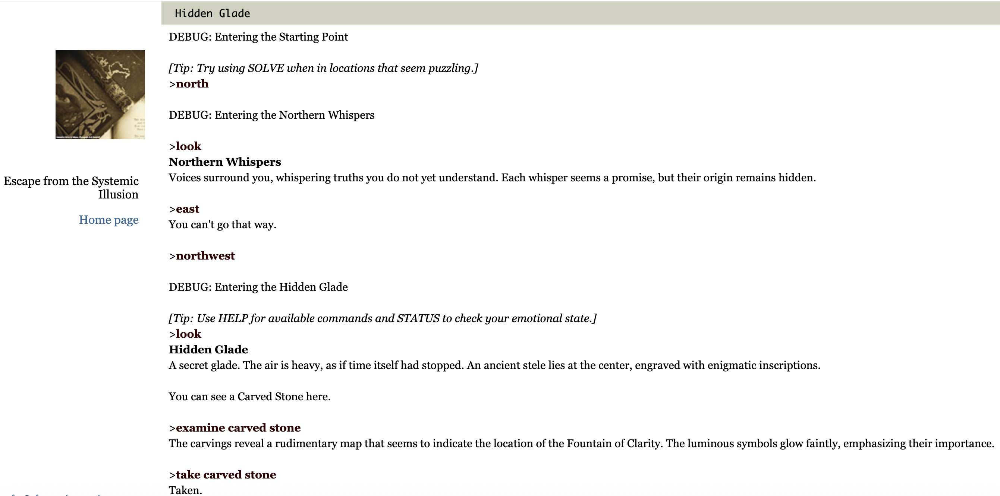

# Escape from the Systemic Illusion

An interactive fiction project written by **Mirlinda Sinanaj**, using **Inform 7**.

This project was created as part of the course **"Interactive Fiction"** taught by **Isaac Pante** (SLI, Letters, UNIL).

## Description

**Escape from the Systemic Illusion** invites the player to explore a symbolic world built upon illusions, social expectations, and hidden truths.  
Through exploration, puzzles, and emotional choices, the player must navigate her way towards autonomy and freedom.

The player must learn to question appearances, resist manipulation, and embrace her own understanding to achieve true liberation.

## How to Play

You can [**download the game here**](https://github.com/MirlindaSinanaj/Escape-from-Systemic-Illusion/archive/refs/tags/v1.0.tar.gz).

After downloading:
- Extract the archive if necessary.
- Play using a Z-machine interpreter like:
  - [Parchment (play online)](https://iplayif.com/)
  - [Frotz](https://davidgriffith.github.io/frotz/)
  - [Lectrote](https://github.com/erkyrath/lectrote)
- Or drag and drop the `.z8` file into [iplayif.com](https://iplayif.com/) to play instantly!

## Working with Inform 7

If you want to view or modify the source files of this fiction:
1. Download [Inform 7](https://inform7.com/)
2. Open the `.inform` project folder in this repository
3. Compile the code or make your own changes

The complete Inform 7 documentation is available [here](https://inform7.com/book/).

## Interface

The game does not use a graphical interface but relies on immersive text descriptions, interpretative choices, and free navigation through over **50 narrative locations**.

Some notable features include:

- A **dynamic emotional system** that changes the narration
- **Reactive NPCs** who offer clues based on the items you carry
- **Poetic riddles** requiring logic, reflection, and memory

## About the Project

- The source code is written in **natural language** using **Inform 7**
- The project explores social, psychological, and philosophical themes
- The game follows a structured format with **six narrative sections**
- The structure is designed to be **expandable** with new rooms and events
